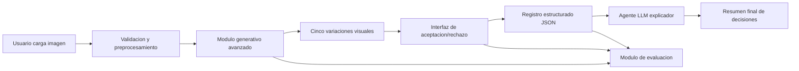

# Propuesta de flujo completo - Proyecto 2 IA

## 1. Interpretacion del encargo

El PDF solicita desarrollar un sistema generativo interactivo que reciba una imagen de entrada del usuario, genere exactamente cinco variaciones visuales, permita aceptar o rechazar cada variacion mediante una interfaz grafica, registre esas decisiones de forma estructurada y use un agente basado en modelos de lenguaje para generar una explicacion final coherente con las decisiones tomadas.

Para el nivel avanzado, la propuesta debe ir mas alla de consumir una API generativa. Se recomienda adaptar un modelo generativo controlable, documentar el entrenamiento o ajuste realizado, analizar estabilidad, diversidad, control de generacion, calidad visual, sesgos y limitaciones.

## 2. Propuesta tecnica de nivel avanzado

### Caso de uso recomendado

Sistema interactivo para generar variaciones visuales controladas de una imagen de entrada, orientado a retratos o imagenes de objetos institucionales. El usuario carga una imagen y el sistema propone cinco alternativas con cambios controlados de estilo, iluminacion, composicion o expresion visual, manteniendo la identidad o estructura principal de la entrada.

Este caso de uso es adecuado porque permite evaluar:

- Calidad visual de las variaciones.
- Diversidad entre alternativas.
- Preservacion de atributos importantes de la imagen original.
- Toma de decisiones humano-IA.
- Explicabilidad posterior basada en decisiones registradas.
- Riesgos eticos, especialmente si se usan rostros.

### Arquitectura recomendada



### Stack recomendado

- Backend: Python, FastAPI o Gradio.
- Modelo generativo: Stable Diffusion img2img o SDXL Turbo adaptado con LoRA y/o ControlNet.
- Librerias: PyTorch, diffusers, transformers, accelerate, safetensors, Pillow, OpenCV.
- Interfaz: Gradio para una demo rapida y robusta, o React + FastAPI si se quiere una arquitectura mas profesional.
- Registro de decisiones: JSON local o SQLite.
- Agente LLM: OpenAI API, modelo local pequeno, o cualquier LLM disponible para generar el resumen textual.
- Evaluacion: LPIPS, SSIM, CLIPScore/CLIP similarity, FID/KID si hay suficientes muestras, encuestas de usabilidad y revision cualitativa.

### Justificacion del nivel avanzado

La opcion recomendada es adaptar un modelo de difusion preentrenado mediante LoRA y controlarlo con img2img/ControlNet. Esto permite cumplir el nivel avanzado porque no se limita a consumir una API, sino que adapta un modelo generativo al dominio elegido, controla atributos visuales y permite analizar problemas reales de entrenamiento, estabilidad, diversidad y fidelidad.

Si el equipo cuenta con GPU limitada, se puede entrenar una LoRA ligera sobre un subconjunto pequeno del dataset y usar inferencia controlada. Si el equipo cuenta con GPU suficiente, se puede ampliar el entrenamiento, comparar configuraciones y reportar metricas mas solidas.

## 3. Flujo funcional completo

### 3.1 Carga de imagen

El usuario carga una imagen en la interfaz. El sistema valida formato, tamano, resolucion minima, canal RGB y posibles errores. Luego genera una version normalizada para el modelo.

Salida esperada:

- Imagen original almacenada.
- Imagen preprocesada.
- Metadatos basicos: nombre, tamano, resolucion, fecha, tipo de archivo.

### 3.2 Preprocesamiento

El sistema redimensiona la imagen al tamano requerido por el modelo, por ejemplo 512x512 o 768x768. Si se trabaja con rostros, puede aplicar deteccion, alineacion y recorte. Si se trabaja con objetos, puede aplicar segmentacion o centrado.

Tecnicas:

- Resize y normalizacion.
- Conversion RGB.
- Filtro de imagenes corruptas.
- Control opcional con Canny, depth map o pose/estructura.

### 3.3 Generacion de cinco variaciones

El modulo generativo produce exactamente cinco variaciones por imagen. Cada variacion debe tener una configuracion distinta, pero controlada.

Ejemplo de configuracion:

- Variacion 1: iluminacion natural.
- Variacion 2: estilo editorial.
- Variacion 3: fondo alternativo.
- Variacion 4: color grading diferente.
- Variacion 5: composicion o textura modificada.

Cada salida debe guardar:

- ID de variacion.
- Seed.
- Prompt o condicion usada.
- Parametros del modelo.
- Ruta de la imagen generada.
- Timestamp.

### 3.4 Interaccion humano-IA

La interfaz muestra la imagen original y las cinco variaciones. Para cada variacion, el usuario debe marcar aceptar o rechazar. Opcionalmente puede agregar una razon corta o una puntuacion.

Reglas:

- No generar el resumen hasta que las cinco variaciones tengan decision.
- Mostrar claramente el estado de cada opcion.
- Registrar todas las decisiones en una estructura persistente.

### 3.5 Registro estructurado

Formato sugerido:

```json
{
  "session_id": "2026-06-22-001",
  "input_image": "uploads/original.png",
  "variations": [
    {
      "id": 1,
      "image_path": "outputs/session_001/variation_1.png",
      "seed": 1842,
      "generation_config": {
        "style": "natural lighting",
        "strength": 0.45,
        "guidance_scale": 7.5
      },
      "user_decision": "accepted",
      "user_reason": "Preserva mejor la identidad visual"
    }
  ]
}
```

### 3.6 Agente explicador

El agente recibe solamente la informacion estructurada de la sesion y genera un resumen textual. El resumen debe indicar explicitamente que variaciones fueron aceptadas y cuales rechazadas.

Requisitos del agente:

- No inventar decisiones.
- Mantener coherencia exacta con el JSON.
- Explicar patrones de seleccion si existen.
- Mencionar criterios observables: calidad, diversidad, estilo, fidelidad, utilidad.

Validacion recomendada:

- Comparar automaticamente el resumen contra el JSON para verificar que los IDs aceptados/rechazados coincidan.
- Reintentar o corregir si el resumen contradice el registro.

## 4. Plan de ejecucion

### Fase 1 - Definicion del problema y alcance

Duracion estimada: 1 a 2 dias.

Actividades:

- Elegir dominio: rostros, objetos, escenas o imagen institucional.
- Definir usuario objetivo.
- Definir atributos visuales que se modificaran.
- Definir restricciones eticas y tecnicas.
- Dibujar arquitectura inicial.

Entregables:

- Descripcion del problema.
- Objetivos del sistema.
- Diagrama de arquitectura.
- Criterios de exito.

### Fase 2 - Dataset y preparacion de datos

Duracion estimada: 2 a 4 dias.

Actividades:

- Seleccionar dataset.
- Justificar calidad, pertinencia y aspectos eticos.
- Hacer exploracion visual y estadistica.
- Preparar scripts de limpieza, redimensionamiento y particion.

Datasets posibles:

- FFHQ o CelebA-HQ si se trabaja con rostros y se discute cuidadosamente el componente etico.
- AFHQ si se prefiere evitar rostros humanos.
- COCO subset, Oxford Flowers, Stanford Cars u otro dominio si el caso de uso lo justifica.

Entregables:

- Dataset preparado.
- Analisis exploratorio.
- Justificacion etica y tecnica.

### Fase 3 - Modelo generativo avanzado

Duracion estimada: 4 a 8 dias.

Actividades:

- Seleccionar backbone generativo.
- Preparar entrenamiento o ajuste LoRA.
- Entrenar/adaptar el modelo con el dataset.
- Implementar generacion img2img o ControlNet.
- Generar cinco variaciones por entrada.
- Guardar parametros de cada variacion.

Entregables:

- Modulo generativo funcional.
- Pesos o configuracion del ajuste.
- Ejemplos generados.
- Analisis de estabilidad, diversidad y limitaciones.

### Fase 4 - Interfaz y registro de decisiones

Duracion estimada: 2 a 4 dias.

Actividades:

- Implementar carga de imagen.
- Mostrar imagen original y cinco variaciones.
- Agregar controles de aceptar/rechazar.
- Guardar decisiones en JSON o SQLite.
- Bloquear resumen hasta completar las cinco decisiones.

Entregables:

- Interfaz funcional.
- Registro estructurado.
- Capturas de pantalla o video corto de interaccion.

### Fase 5 - Agente LLM y explicabilidad

Duracion estimada: 2 a 3 dias.

Actividades:

- Definir prompt del agente.
- Pasar al agente el JSON de decisiones.
- Generar resumen final.
- Validar que el resumen coincida con aceptados/rechazados.
- Agregar el resumen a la interfaz.

Entregables:

- Agente explicador integrado.
- Prompt documentado.
- Ejemplos de resumen.
- Validacion de coherencia.

### Fase 6 - Evaluacion integral

Duracion estimada: 2 a 4 dias.

Actividades:

- Medir calidad visual.
- Medir diversidad.
- Evaluar coherencia del agente.
- Evaluar usabilidad con usuarios.
- Analizar limitaciones y sesgos.

Metricas sugeridas:

- Calidad visual: CLIP-IQA, evaluacion humana 1-5.
- Diversidad: LPIPS promedio entre variaciones, SSIM inverso.
- Fidelidad a entrada: CLIP similarity o SSIM segun dominio.
- Coherencia del agente: exactitud de IDs aceptados/rechazados.
- Usabilidad: SUS simplificado, tiempo por tarea, errores de interaccion.

Entregables:

- Tabla de metricas.
- Analisis critico.
- Limitaciones.
- Propuestas de mejora.

### Fase 7 - Documentacion y demostracion

Duracion estimada: 2 a 3 dias.

Actividades:

- Redactar informe tecnico maximo de cinco paginas.
- Incluir arquitectura, dataset, modelo, interfaz, resultados, etica y limitaciones.
- Preparar video o demo en vivo.
- Verificar reproducibilidad del codigo.

Entregables finales:

- Codigo completo.
- Documento tecnico.
- Diagramas y capturas.
- Video o demo funcional.
- Instrucciones de ejecucion.

## 5. Estructura recomendada del repositorio

```text
project/
  app/
    main.py
    ui.py
    api.py
  generation/
    preprocess.py
    train_lora.py
    generate_variations.py
    model_config.yaml
  agent/
    explain.py
    prompt_template.txt
    validate_summary.py
  evaluation/
    metrics.py
    user_study_form.md
    results.csv
  data/
    raw/
    processed/
  outputs/
    sessions/
    examples/
  docs/
    architecture.md
    report.pdf
    demo_script.md
  README.md
  requirements.txt
```

## 6. Rubrica convertida en estrategia

Para maximizar la nota:

- Diseno del sistema, 4 puntos: entregar diagrama claro, caso de uso coherente e integracion completa.
- Modelo generativo, 4 puntos: demostrar adaptacion avanzada, cinco variaciones exactas, diversidad y analisis del modelo.
- Interaccion humano-IA, 4 puntos: interfaz simple, clara y funcional, con registro estructurado.
- Explicabilidad, 3 puntos: resumen fiel al JSON, sin contradicciones.
- Evaluacion y analisis, 3 puntos: usar metricas y discutir limitaciones tecnicas.
- Etica y documentacion, 2 puntos: reflexion especifica, no generica, con evidencia visual y documento ordenado.

## 7. Inputs requeridos para completar todo el proyecto

### Decisiones de alcance

- Dominio visual elegido: rostros, objetos, escenas, productos u otro.
- Caso de uso exacto: por ejemplo, variaciones de retratos profesionales, productos para catalogo, fondos institucionales, etc.
- Nivel de realismo esperado.
- Atributos que deben variar: estilo, iluminacion, fondo, expresion, color, composicion.
- Atributos que deben preservarse: identidad, forma, objeto principal, estructura, colores institucionales.

### Recursos tecnicos

- Disponibilidad de GPU local, Google Colab, Kaggle, Paperspace u otro entorno.
- Sistema operativo donde se ejecutara la demo.
- Restricciones de uso de APIs externas.
- Claves API si se usara un LLM externo.
- Tiempo disponible hasta la entrega.

### Datos

- Dataset elegido o permiso para descargar uno publico.
- Numero aproximado de imagenes a usar.
- Criterios de filtrado.
- Licencia o condiciones de uso del dataset.
- Imagenes de prueba para la demo.

### Interfaz y demo

- Preferencia de interfaz: Gradio, Streamlit, React/FastAPI u otra.
- Idioma del sistema: espanol o ingles.
- Formato de demostracion: video o presentacion en vivo.
- Duracion maxima del video si aplica.

### Evaluacion

- Numero de usuarios disponibles para probar el sistema.
- Formulario de evaluacion deseado.
- Criterios de aceptacion/rechazo que se pediran al usuario.
- Si se incluiran razones textuales opcionales por cada decision.

### Documento final

- Plantilla requerida por el curso, si existe.
- Nombres de integrantes.
- Fecha exacta de entrega.
- Formato requerido: PDF, LaTeX, Word o Markdown.
- Reglas de citacion solicitadas.

## 8. Recomendacion final

La ruta mas solida para completar el proyecto con nivel avanzado es construir una aplicacion Gradio o FastAPI que use un modelo de difusion img2img adaptado con LoRA y controlado con parametros de variacion. Esta ruta es suficientemente avanzada para justificar entrenamiento/adaptacion, pero tambien realista para entregar un sistema funcional, evaluable y demostrable dentro de un curso.

La prioridad tecnica debe ser que el sistema completo funcione de extremo a extremo:

1. cargar imagen,
2. generar exactamente cinco variaciones,
3. registrar aceptacion o rechazo,
4. producir resumen explicativo fiel a las decisiones,
5. evaluar calidad, diversidad, usabilidad y etica.

