# Architecture

## Goal

The system receives one user image, produces exactly five professional studio-style portrait edits, collects keep/pass feedback for every look, and generates a final explanation tied to the recorded decisions.

## Components

```mermaid
flowchart LR
    A["Image upload"] --> B["Preprocess 512x512 RGB"]
    B --> C["Stable Diffusion img2img"]
    C --> D["Five studio looks"]
    D --> E["Face lock pass"]
    E --> F["FastAPI browser UI"]
    F --> G["Keep/pass decisions"]
    G --> H["Session record JSON"]
    H --> I["Explanation agent"]
    I --> J["Final summary"]
```

## Runtime modules

- `app/main.py`: FastAPI endpoints and web UI wiring.
- `app/services/generator.py`: CUDA diffusion generator, demo-mode studio transforms, and face-preservation pass.
- `app/services/storage.py`: session folders and JSON records.
- `app/services/explainer.py`: faithful explanation agent based on stored decisions.
- `app/services/evaluation.py`: starter diversity metric.
- `config/generation.yaml`: selected dataset, model, and five generation parameter sets.

## Session contract

Every session stores:

- Original uploaded image.
- Five generated professional studio looks.
- Seed, prompt, strength, and guidance scale for each variation.
- Face-lock flag and detected face count.
- One accept/reject decision for each variation.
- Optional user reason per decision.
- Final summary.
